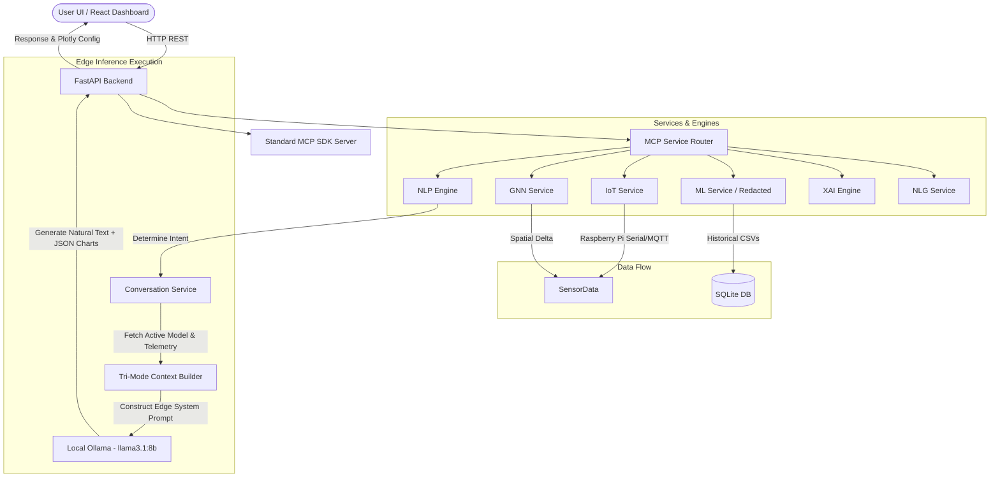

# 🌤️ weatherBOT v2.0 — Edge AI Weather Intelligence Platform

`weatherBOT` is a highly restricted, offline AI Weather Intelligence Platform engineered to operate entirely on isolated Edge devices (including Raspberry Pi). It leverages localized Machine Learning models (Redacted), PyTorch Graph Neural Networks (GNN), and a local LLM (Ollama `llama3.1:8b`) to provide zero-latency, secure weather predictions without relying on real-world internet connectivity or external APIs.

## 🏗️ System Architecture Overview



## 🔵 Core Components

### Backend (Python/FastAPI)
- **MCP Service Router**: A central dispatcher routing requests to 10 specialized microservices.
- **MCP SDK Server**: A standard `mcp_server.py` exposing 32 tools, resources, and prompts for external MCP clients like Claude Desktop.
- **IoT Service**: Directly integrates with Raspberry Pi via USB Serial (`pyserial`) and MQTT (`paho-mqtt`), with a built-in sinusoidal simulator fallback.
- **Engines & Managers**:
  - `nlp_engine.py`: Intent classification (8 types) & entity extraction.
  - `explainable_ai_engine.py`: SHAP-style explanations and attention maps.
  - `recommendation_engine.py`: Context-aware follow-up chips.

### Frontend (React/Vite)
- **Framework**: React 19 + Vite + Tailwind CSS v4.
- **Features**: Chat window with Recommendation Chips, a collapsible Explainable AI (XAI) Panel, and a robust Settings page for managing Raspberry Pi IoT connections and system modes.

## 🚀 Tri-Mode Execution

The system prompt is dynamically constructed in `conversation_service.py` based on three strict operating modes:
1. **Historical Data Mode**: Injects metrics from a trained Redacted model (RMSE, Feature Importances, Sample Data). The LLM is strictly instructed to ignore any live sensor requests.
2. **Live Station Mode**: Injects live telemetry from connected IoT weather nodes alongside a PyTorch GNN spatial delta prediction. The LLM must ignore historical data.
3. **Prime Mode**: Injects BOTH Historical ML data and Live GNN data, requiring the LLM to synthesize both sources for a comprehensive analysis.

## 📦 Getting Started

### 1. Prerequisites
- Python 3.13
- Node.js (v20+)
- [Ollama](https://ollama.com/) with the `llama3.1:8b` model pulled locally (`ollama run llama3.1:8b`).

### 2. Run the AI Backend
```bash
cd backend
python -m venv .venv
.\.venv\Scripts\activate
pip install -r requirements.txt
python -m uvicorn main:app --reload
```
*The backend API will run on `http://localhost:8000`.*

### 3. Run the Frontend Dashboard
Open a **second** terminal window:
```bash
cd frontend
npm install
npm run dev
```
*The Tri-Mode dashboard will be available at `http://localhost:5173`.*

### 4. Optional: Run the MCP SDK Server
Open a **third** terminal window:
```bash
cd backend
.\.venv\Scripts\activate
python mcp_server.py
```
*Exposes weatherBOT tools to any MCP client.*

### 5. Authentication
- **Username**: `admin`
- **Password**: `admin`

---
*Developed for isolated edge environments.*
